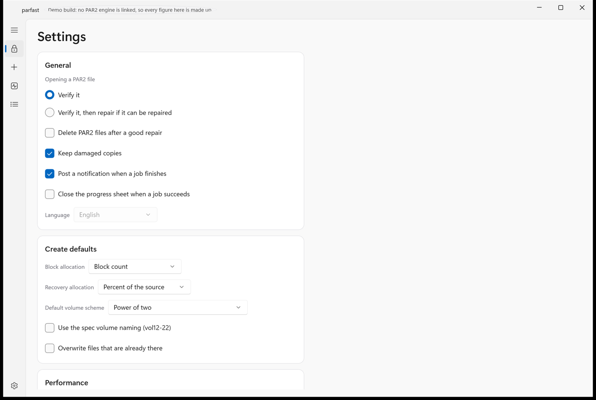

# parfast for desktop

parfast protects files with PAR2 recovery data, checks files you already
have, and repairs files that have gone missing or been damaged. This is
the guide to the desktop app. The command line tool of the same name is
covered by `parfast --help`, and the two share one engine, so anything
the app can do the command line can do as well.

> **The app is an ALPHA.** It builds, it passes a measured acceptance
> corpus on both platforms, and the screenshots below are of the real
> thing - but it has not been lived with, and nobody has yet spent a day
> driving it by hand. Expect rough edges. The engine underneath is the
> one the parfast command line tool ships, which is further along; it is
> the app around it that is new. Where the app and this page disagree,
> the app is right and this page is behind: please say so if you find a
> difference.

## What PAR2 is for, in one paragraph

A PAR2 set is a small amount of extra data stored beside your files. If
one of those files is later damaged or lost, the extra data can rebuild
the missing part exactly, byte for byte, without a backup of the whole
thing. How much you can lose and still recover is decided when you
create the set: a set made with ten percent recovery can rebuild about
ten percent of the protected data. PAR2 cannot rebuild more than it was
given, so the figure you choose at creation is the figure you live with.

## The four modes

The window has one mode picker, always visible, with four entries.

### Verify and repair

The landing mode, and the one a `.par2` file opens into.

Open a set by dragging a `.par2` file onto the window, by double
clicking one in the Finder or in File Explorer once parfast is
registered for them, or with the Open button. The set is checked
immediately. A large set takes a while, because every protected file is
read and hashed; the progress is live and can be cancelled.

At the top, a header card names the set, the folder it lives in, and
four figures: how many files it protects, the block size, how many
source blocks there are, and how many recovery blocks are available.

Beside them a **status pill** says where you stand:

| Pill | What it means | What to do |
|---|---|---|
| Verifying | The check is still running | Wait, or cancel |
| Complete, no repair needed | Every file is intact | Nothing |
| Repairable | Something is wrong and there is enough recovery data to fix it | Press Repair |
| Not repairable | More is missing than the recovery data can rebuild | Find the missing files, or scan other folders |
| Repairing | The repair is running | Wait, or cancel |
| Repaired | The repair finished and the result was checked | Nothing |
| Repair failed | The repair ran and the result did not verify | Read the log |

Under the header is the **block map**, which is the quickest way to see
what is wrong. See the legend below.

Under that is the **file table**: name, size, status, and how many of
each file's blocks are present. A filter switches between all files and
only the ones with a problem. Right click a row for Reveal, Rename to
the expected name, and Exclude from repair.

The action bar carries Verify again, Scan other folders, an Options
popover, and the Repair button. Repair is only enabled when the verdict
says repairable.

**Scan other folders** is the one to reach for when a file has been
moved rather than lost. parfast looks in the folders you add for data
belonging to this set, under any name, and folds anything it finds into
the verdict. A set that reads as not repairable often becomes complete
the moment the right folder is added.

**Options** covers what happens around a repair: purge the PAR2 files
and backups afterwards, keep a copy of each damaged file with a `.1`
suffix, rename only mode for a set whose files are all present under the
wrong names, data skipping for a file whose contents have been shifted,
the fast solver, and a thread count.

### Create

Build a new PAR2 set.

On the left, the **sources**: add files, add a folder with or without
its subfolders, remove, refresh, or drag things in. A footer line counts
what you have. **File paths** chooses whether names are stored bare or
relative to a base folder, which matters if you are protecting a tree
rather than a flat list.

On the right, the **set**. **Source blocks** is either a block size or a
block count, whichever you would rather think in; the other is shown as
a readout, along with the wasted padding and the efficiency. **Recovery**
is a percentage, a block count, or a total size, again with the other
two shown. Quick chips offer five, ten, fifteen and twenty percent.

**Output** names the index file, chooses how the recovery data is split
into volumes, and carries the comment field, the first recovery block
offset for extending a set you already have, and an overwrite checkbox.

The **preview** table shows every file the set will produce with its
size, block count and efficiency, before anything is written. Copy
command gives you the exact command line that would do the same thing,
which is what you want if the real job belongs in a script.

Create starts the job. Add to queue puts it in line behind whatever else
is running.

### Checksums

Create or check an SFV, MD5, SHA-1 or SHA-256 file. These are not PAR2
and cannot repair anything; they tell you whether a file has changed.
Create takes a list of files and writes the checksum file; Verify opens
one and reports each entry as ok, mismatched or missing.

### Queue

Everything runs through the queue, including a job you started directly,
so this tab always shows the truth. Pause the queue, run a selected job
now, remove one, or clear the finished ones. A When the queue finishes
setting can do nothing, notify you, sleep the machine or shut it down;
the last two ask for confirmation when you set them.

The queue survives a restart. A job that was running when the app quit
comes back marked Interrupted and can be run again.

## The block map legend

The block map draws one cell per source block, in set order, so the
picture is the set itself rather than a summary of it.

| Colour | State | Meaning |
|---|---|---|
| Green | Present | The block is where it should be and its checksum matches |
| Red | Damaged | The block is inside a file that exists, and it does not match |
| Dark red | Missing | The block belongs to a file that is not there |
| Amber | Found elsewhere | The block was found under another name, or in another folder |
| Blue, pulsing | Being checked | The verify has not reached this block yet |

Under the map is a thinner **recovery band**. It draws the recovery
blocks you have against the number the repair needs, with the needed
count marked. If the band is longer than the mark, the repair can run.

Above about four thousand blocks a single cell would be less than a
pixel, so cells merge into proportional segments. A segment holding any
damage still shows that damage rather than averaging it away, and
hovering names the range, for example blocks 2,048 to 2,303, and what is
wrong inside it.

## Settings

**General.** What opening a `.par2` does: check it only, or check it and
repair it if it can be repaired. Whether to purge after a repair by
default. Whether to keep damaged copies. Notifications. Whether the
progress sheet closes itself on success. Language.

**Create defaults.** How new sets are sized by default, which recovery
allocation is preselected, the default volume scheme, and the naming and
unicode options.

**Performance.** Thread count, memory limit, the fast solver, and
whether jobs run at low priority by default. The defaults are picked
from the machine and are usually the right answer; the reason to change
them is to leave room for something else you are doing at the same time.

**Integration.** Register parfast as the handler for `.par2`, `.sfv`,
`.md5` and `.sha256`, and turn the Finder Quick Action or the File
Explorer context menu entries on and off.

**Advanced.** Show the equivalent command line everywhere, the log level
and log folder, and Reset to defaults.

## Things worth knowing

**A repair rewrites your files in place.** That is what repairing is.
Keep a copy of anything you cannot lose, the same as you would with any
other tool of this kind. Keep damaged copies, in Options, is the cheap
insurance: it leaves each damaged original beside the repaired file with
a `.1` on the end.

**A set can only rebuild as much as it was given.** If the status pill
says not repairable and names a shortfall, no option in the app will
close that gap. What can close it is finding more of the original data:
another copy of a file, a folder you forgot, or more recovery volumes
from wherever the set came from.

**Renamed is not the same as lost.** If the files are all present but
under the wrong names, the verdict will still say repair is required,
and the repair will restore the names. Rename only mode, in Options,
does that and nothing else, which is quicker on a large set.

**Extra recovery volumes are free to add.** Drop more `.vol` files from
the same set into the folder and check it again; the recovery figure in
the header goes up.

## Getting help

The log drawer holds the transcript of whatever just ran, in the same
words the command line tool would have printed, and it is copyable.
Copy command, beside it, gives the command line that would reproduce the
job. Both of those are the two most useful things to attach to a bug
report.

Source and issues: https://github.com/nzbfast/nzbfast

<!--
SCREENSHOTS. Taken 12 Sep 2026 in phase 1 of the QA chip, on the WINDOWS
app against the mock scenarios, at the app's default 1280 x 860 logical
window, light theme, by apps/parfast/windows/tools/screenshots.ps1. They
are in images/ beside this file.

ONE PER STATE, not one per state per theme per platform. The owed list
this comment replaces asked for the full matrix, which is forty files
and about five megabytes in a guide with ten places to put a picture.
The two apps draw from the same shared tokens and the same block map
rule, and where they genuinely differ the prose says so, so a second
platform's copy of the same screen is weight rather than information.

THE FULL SETS ARE BANKED AND ARE WHERE TO LOOK IF YOU NEED ANOTHER:

  research/parfast-gui-mac-2026-09-12/            mac, mock, light + dark
  research/parfast-gui-mac-2026-09-12/real-engine/ mac, real engine
  research/parfast-gui-qa-2026-09-12/             the frames that are
                                                  evidence for a defect,
                                                  both platforms

The four states with no picture here - verify-unrepairable,
verify-misnamed, repair-summary and the progress sheet - are shot and
banked but not linked: the pill table and the file-status table already
say what each one looks like, and a guide reads worse with a picture
every two paragraphs than with none. They are in images/ ready to link
if that judgement changes.
-->
